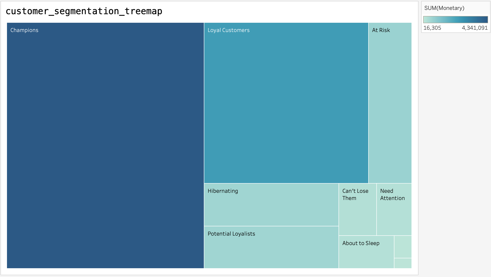

# Customer Segmentation Analysis
This project uses RFM analysis to categorize customers based on transaction behavior.

## Customer Segmentation Visualization

### 📈 Project Insights
* **Champions ($4.3M):** Our most valuable segment. These customers buy often and spend the most. **Strategy:** Reward them with early access to new products.
* **Loyal Customers:** A steady revenue stream. **Strategy:** Use loyalty programs to keep them engaged.
* **At Risk:** Customers who haven't purchased in a while. **Strategy:** Send personalized "We miss you" email campaigns with a discount code.

### 🛠️ Tech Stack
* **Tableau:** For advanced data visualization and treemap generation.
* **Python:** For performing the RFM (Recency, Frequency, Monetary) calculations.
* **Markdown:** For professional project documentation.
